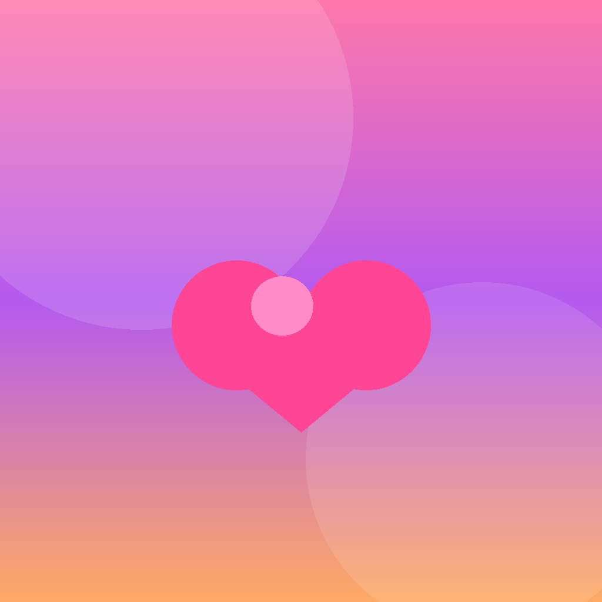

<div align="center">



# FLAMES

### *Discover Your Connection*

**The classic relationship game you grew up playing — completely reimagined for iOS.**

[](https://swift.org)
[](https://developer.apple.com/ios/)
[](https://developer.apple.com/xcode/swiftui/)
[](LICENSE)

---

</div>

## What is FLAMES?

FLAMES is a sleek, dark-luxury iOS app that brings the beloved childhood compatibility game to life. Enter two names, tap **Reveal FLAMES**, and let the algorithm decide your fate in one letter.

> **F** — Friends &nbsp; **L** — Love &nbsp; **A** — Affection &nbsp; **M** — Marriage &nbsp; **E** — Enemies &nbsp; **S** — Siblings

No fluff. No filter. Just the truth.

---

## Pitch Video

https://github.com/roszhan2684/Flames/raw/main/flames_pitch_video.mp4

> *Can't play inline? [Download the pitch video](flames_pitch_video.mp4)*

---

## Screenshots

| Splash | Home | Result | History | About |
|:---:|:---:|:---:|:---:|:---:|
|  |  |  |  |  |

---

## Features

### Core Experience
- **Instant Results** — Type two names, get your answer in seconds
- **The Real Algorithm** — Authentic FLAMES mechanics: removes common letters, counts what remains, eliminates letters in sequence until one stands
- **Six Outcomes** — Every result comes with a personality description, not just a letter

### Design
- **Dark Luxury UI** — Deep `#0F0F1E` background with violet and rose glow orbs
- **Glassmorphism Cards** — Frosted-glass result cards with subtle depth
- **Gradient Buttons** — Violet-to-rose gradients on every interactive element
- **Smooth Animations** — Spring-physics transitions throughout

### Built-in Features
- **History** — Every match automatically saved locally. Never lose a result
- **Share** — Share your result as an image directly to Instagram, iMessage, or anywhere
- **Legend** — In-app reference for all six FLAMES outcomes with colour-coded badges
- **Try Again** — One tap back to the home screen for instant rematches

---

## How It Works

```
1. Remove all letters that appear in both names
2. Count the remaining letters
3. Starting from F, eliminate every Nth letter (N = count)
4. The last letter standing is your FLAMES result
```

**Example:** Alex + Sam

```
Alex → A L E X       Remove common letters (A appears in both)
Sam  → S A M         Remaining: L E X S M  →  count = 5

Cycle: F L A M E S → eliminate every 5th
       F(1) L(2) A(3) M(4) [E](5) → E eliminated
       S(1) F(2) L(3) A(4) [M](5) → M eliminated
       E(1) S(1) F(1) L(1) [A](5) → A eliminated
       S(1) F(1) [L](5-ish)→ ... → F = Friends ✓
```

---

## Tech Stack

| Layer | Technology |
|---|---|
| Language | Swift 5.9 |
| UI Framework | SwiftUI |
| Architecture | MVVM |
| Persistence | UserDefaults (JSON encoded) |
| Minimum Target | iOS 17.0 |
| IDE | Xcode 16+ |

### Project Structure

```
Flames/
├── Components/
│   ├── GradientBackground.swift   # Reusable animated background
│   ├── InputTextField.swift       # Branded text input component
│   ├── PrimaryButton.swift        # Gradient CTA button
│   └── ResultCard.swift           # Glassmorphism result display
├── Models/
│   ├── FlamesResult.swift         # Result enum + descriptions
│   └── HistoryItem.swift          # Saved match model
├── Services/
│   ├── FlamesCalculator.swift     # Core FLAMES algorithm
│   └── HistoryStorage.swift       # Local persistence layer
├── Utilities/
│   ├── Constants.swift            # Colors, fonts, dimensions
│   └── String+Extensions.swift   # Letter-removal helpers
├── ViewModels/
│   ├── FlamesViewModel.swift      # Home screen state
│   └── HistoryViewModel.swift     # History screen state
└── Views/
    ├── SplashView.swift           # Animated launch screen
    ├── HomeView.swift             # Name entry + Reveal
    ├── ResultView.swift           # FLAMES result display
    ├── HistoryView.swift          # Saved matches list
    └── AboutView.swift            # Legend + how it works
```

---

## Installation

### Requirements
- Xcode 16 or later
- iOS 17.0+ device or simulator
- macOS Ventura or later

### Steps

```bash
# Clone the repository
git clone https://github.com/roszhan2684/Flames.git
cd Flames

# Open in Xcode
open Flames.xcodeproj

# Select your target device and run (⌘R)
```

No dependencies. No package manager. Pure SwiftUI.

---

## Design Philosophy

FLAMES was built on three principles:

**1. Instant gratification** — The path from open-app to result is three taps. No accounts, no loading screens, no friction.

**2. Premium feel for a fun concept** — The dark luxury aesthetic treats a childhood game with the same visual care as a finance or wellness app. Because why not?

**3. Nostalgia, reimagined** — Everyone played FLAMES on paper in school. This is that memory, made beautiful.

---

## Brand Colors

| Role | Hex | Preview |
|---|---|---|
| Background | `#0F0F1E` |  |
| Violet | `#8C33F2` |  |
| Rose | `#E5164A` |  |
| Gold (Result) | `#FFCA40` |  |
| White | `#FFFFFF` |  |

---

## License

MIT © 2026 Roszhan Raj. See [LICENSE](LICENSE) for details.

---

<div align="center">

**Built with SwiftUI · Designed for iOS · Made with love**

*Some connections just can't be explained... until now.*

</div>
